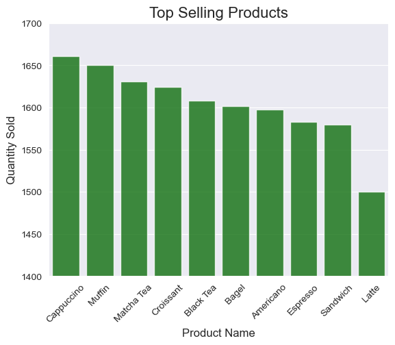
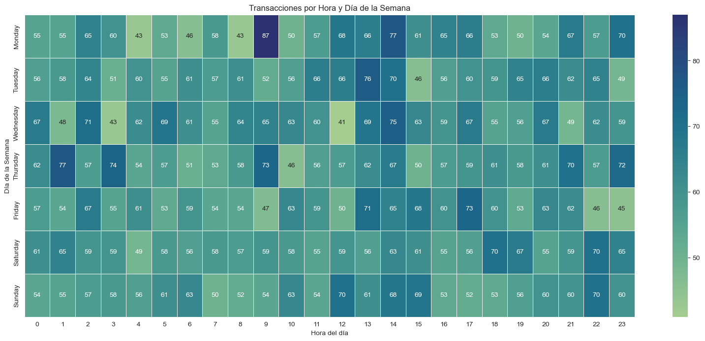
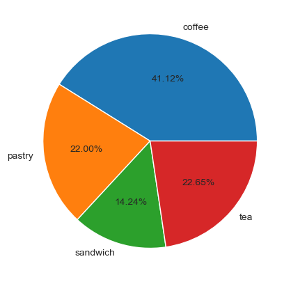

# Análisis de una Cadena de Cafeterías

## Descripción

Este proyecto realiza un análisis exhaustivo de una cadena de cafeterías que están en estados unidos.
El objetivo principal es analizar los patrones de consumo, preferencias de productos, horarios de mayor a menor venta y
rendimiento financiero de una cadena de cafeterías a partir de una base de datos relacional.

## Herramientas y Tecnologías Utilizadas
- SQL
- MySQL
- Python 3.12
- Pandas
- Matplotlib / Seaborn
- SQLALchemy
- Jupyter Notebook

## Pasos del Análisis

### 1. Exploración de datos

Se explorarón los datos en conjunto mediante Pandas, no hubo datos nulos, los tipos de datos estaban todos correctos,
a primera vista no hay nada fuera de lo común.

### 2. Limpieza y Preparación

Como segundo paso lo que hizo en seguida fue añadir las siguientes columnas: Año, Nombre del Mes, Día de la Semana,
día del mes, y la hora. Todo esto para luego tener un mejor análisis, y más datos que nos serán de ayuda, y también se
eliminó la columna original de la fecha de la transacción, ya que para efectos de análisis ya no lo ocupamos

### 3. Análisis Descriptivo

Tuvimos un par de preguntas por responder, que son las siguientes:

 - ¿Cuáles son los productos más vendidos por ciudad o tienda?
 - ¿Qué días y horas tienen mayor volumen de ventas?
 - ¿Cuál es el ticket promedio por tienda?
 - ¿Qué perfil de cliente (edad, género) consume más café?
 - ¿Qué porcentaje del total de ventas representan los productos de panadería?

Y acompañado de las siguientes visualizaciones: 
- Gráfico de barras: productos más vendidos.
- Heatmap: transacciones por hora y día de la semana.
- Boxplot: ticket promedio por ciudad.
- Pie chart: distribución de categorías de productos.

Y esto fue lo que se encontró a partir del siguiente análisis:

**1. ¿Cuáles son los productos más vendidos por ciudad o tienda?**

| Ciudad      | Vecindario         | Producto  | Cantidad |
|-------------|--------------------|-----------|----------|
| San Jose    | Westside           | Americano | 61       |
| Chicago     | Chinatown          | Espresso  | 47       |
| San Antonio | Midtown            | Capuchino | 47       |
| Los Angeles | Eastside           | Capuchino | 40       |
| San Jose    | Financial District | Sandwich  | 35       |

Aquí se observan los primeros 5, de la cantidad del mejor producto de cada sucursal, pero a la vez se nota la cantidad 
de productos que venden, porque entre más venden de su mejor producto nos podemos dar una idea de cuanto venden de todos
los productos.

De igual manera se acompaña esta tabla con los 10 productos más vendidos en un orden de mayor a menor

 

**2. ¿Qué días y horas tienen mayor volumen de ventas?**

Se hayó un patrón que indica que todos los días de la semana entre las 12:00 y 17:00 horas hay mayor número de clientes
y eso indica que hay más ventas y, por lo tanto, los horarios más ideales para prestar más atención serían esas horas,
aun así luego de las 17:00, de igual manera en todas las horas de todos los días que está ocupado con alrededor 
de entre 60 y 70 transacciones al día, el unico día y hora que resalta entre todos, es el lunes a las 9:00 horas,
probablemente debido a que es cuando muchas personas se despiertan para ir a sus trabajos o simplemente son personas
que van a desayunar "temprano" y una hora ideal es a las 9:00.

 

**3. ¿Cuál es el ticket promedio por tienda?**

Aquí se logra ver una estabilidad del ticket promedio, ya que no parece variar mucho, solo varía por un par de centavos

| Ciudad       | Ticket |
|--------------|--------|
| New York     | 4.52   |
| Dallas       | 4.48   |
| Los Angeles  | 4.48   |
| San Antonio  | 4.46   |
| Phoenix      | 4.45   |
| Philadelphia | 4.43   |
| San Jose     | 4.43   |
| Houston      | 4.40   |
| San Diego    | 4.39   |
| Chicago      | 4.32   |

Por lo tanto, no se ven grandes hallazgos, por lo que podría indicar que ninguna tienda tiene mayor cantidad de
clientes que otras tiendas, todas tienen la misma continuidad de clientes, por lo que eso sería un punto a tratar
de mejorar, tratar de hacer que los clientes gasten más en distintos productos, o sacar nuevos productos y enfocarse
en esos. Debido a que en ciudades con un poder adquisitivo mayor gastan igual que en otras ciudades con un poder
adquisitivo menor, ese sería otro punto a mejorar.

**4. ¿Qué perfil de cliente consume más café?**

Aquí se ve algo curioso, ya que podemos ver que los primeros 5 lugares son mujeres abarcando juntas unos 448 cafés
hasta la fecha, y las primeras 3 están dentro de los 50 y 70 años, y las otras 2 alrededor de los 20 años y 30 años.

| Género | Edad | Cantidad |
|--------|------|----------|
| Mujer  | 56   | 102      |
| Mujer  | 69   | 89       |
| Mujer  | 53   | 88       |
| Mujer  | 34   | 85       |
| Mujer  | 20   | 84       |

Sin embargo, investigando más a fondo se descubrió que las mujeres han tomado más café, con una diferencia de 174
cafés hasta la fecha, por lo que podríamos intuir, que el café de esa cadena de cafetería atrae más a las mujeres,
ya sea por la temática, la luz, etc., indica que nuestro público objetivo, son las mujeres, pero sin ninguna
diferencia importante como para dedicarse específicamente a las mujeres.

| Género | Cantidad | Porcentaje |
|--------|----------|------------|
| Mujer  | 3258     | 51.37%     |
| Hombre | 3084     | 48.62%     |

Dentro de los hombres, logramos ver que el rango de edad que más toman están dentro de los 30 a 65 años, el segundo
lugar y el último son los más jóvenes dentro de los 30 años de edad, y los otros 3 están dentro de los 45 a 65 años.

| Edad | Cantidad |
|------|----------|
| 45   | 83       |
| 33   | 81       |
| 51   | 78       |
| 65   | 77       |
| 39   | 74       |

**5.¿Qué porcentaje del total de ventas representan los productos de cafetería?**

Aquí podemos ver dentro de las cafeterías, la mayor parte de las ventas es de café, con un 44.12% de las ventas
totales, luego le sigue los tés y los pasteles, los dos con un 22% de las ventas cada uno, luego le sigue los
sandwiches con un 14% de las ventas, probablemente se deba a los costos de este y a su nula variedad dentro de esta
categoría, ya que mientras el café tiene 4 variedades, el sandwich solo tiene uno, además de que es el producto
más caro de todos.

 

## 4. Conclusiones

1. Viendo los productos más vendidos en cada tienda y relacionándolo con 10 productos más vendidos en general, se debe
de tener mayor prioridad, todos los cafés, debido a que son el fuerte de la empresa, y tratar de mejorar las ventas
del sandwich y también del Latte, para tratar de diversificar los ingresos, puede ser con descuentos en estos
productos o con alguna otra estrategia
2. En horarios, todo se ve tranquilo con cierta estabilidad de clientes, pero poner en alerta a los meseros de 12:00
a 17:00 horas debido a que se ve mayor actividad, pero también poner mucho cuidado el lunes a las 9, debido a que hay
un cambio brusco de clientes, por lo que podríamos capacitar a los cocineros y meseros para que no los agarre de
sorpresa y no se vea afectada la cafetería.
3. Mejorar el flujo de clientes en las diferentes ciudades, y tratar que cada cliente aumente su gasto, debido a que se
que por cada cliente solo gasta $4.40, esto es muy bajo, si lo comparamos al costo de vida de las ciudades en las que
estamos, se puede hacer promociones, descuentos, o compensar a clientes fieles dandoles a solo ellos ventajas exclusivas
para aumentar las ventas por cliente.
4. Aunque no por mucho las mujeres son nuestro principal cliente, por lo que podríamos ambientar nuestros cafés
con aromas, con la arquitectura más orientada a las mujeres, sin dejar de lado a los hombres, pero que nuestros
ambientes estén orientados para personas con una edad de alrededor de los 45 a 60 años en general, debido a que es la
edad de muchos clientes.
5. Como último, se necesita mejorar la venta de la categoría de sandwich porque solo el 14% de nuestras ventas es de eso,
mientras que las otras categorías más cercanas están en el 22%.

## Autor

Leonardo Martínez Tello

GitHub: leon-mtz07

IG: leon_mt_07